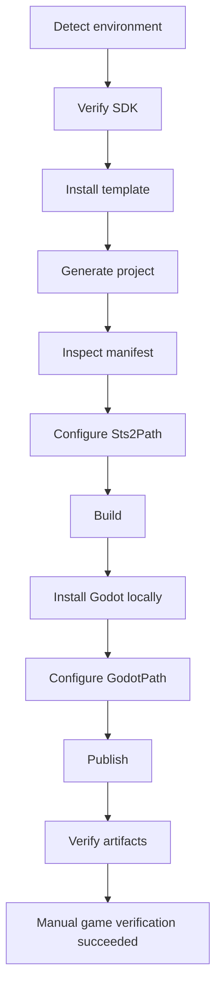
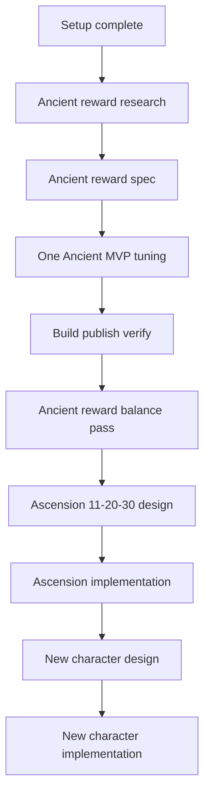

# Project Map

## Actual Directory Tree (Current)
```text
dev-the-spire/
  .gitattributes
  .gitignore
  AGENTS.md
  README.md
  Directory.Build.props
  Directory.Build.props.example
  EzDailyContent.csproj
  EzDailyContent.json
  EzDailyContent.sln
  EzDailyContent.sln.DotSettings
  Sts2PathDiscovery.props
  export_presets.cfg
  project.godot
  EzDailyContent/
    mod_image.png
    images/
      card_portraits/
      powers/
      relics/
    localization/
      eng/
  EzDailyContentCode/
    MainFile.cs
    Cards/
    Extensions/
    Powers/
    Relics/
  docs/
    SETUP_SPEC.md
    PROJECT_MAP.md
    dev-environment.md
    test-plan.md
    release-checklist.md
    codex-workflow.md
    first-feature-backlog.md
    _future/
      planning/
        design-operating-brief.md
      new-character/
        downfall-character-reference.md
        boss-character-design-knowledgebase.md
        boss-character-concepts-v2.md
        ceremonial-beast-character-draft.md
        ceremonial-beast-v3-bell-crowned-design.md
```

Generated build/cache/tool output such as `.godot/`, `.tools/`, `bin/`, and `obj/` is intentionally omitted from this map.

## File Purpose
- `AGENTS.md`: persistent machine-readable operating rules for Codex sessions.
- `README.md`: human-facing overview and current setup/project direction.
- `Directory.Build.props`: local gitignored build/publish path configuration. Current local `Sts2Path` is `D:/Steam/steamapps/common/Slay the Spire 2`; current local `GodotPath` points into `.tools/godot-4.5.1-mono`.
- `Directory.Build.props.example`: committed template for new machines. Copy it to `Directory.Build.props` and fill in local paths.
- `Sts2PathDiscovery.props`: template-generated OS-specific game path discovery.
- `EzDailyContent.sln`: solution file containing the existing `EzDailyContent.csproj`; added to satisfy Godot .NET export expectations.
- `EzDailyContent.csproj`: generated C#/.NET Godot project.
- `EzDailyContent.json`: generated mod manifest. Manifest id is `EzDailyContent` and must not change.
- `EzDailyContent/`: generated Godot resource folder, localization placeholders, and placeholder images.
- `EzDailyContentCode/`: generated C# scaffolding. Current card/power/relic files are abstract base scaffolds only; no concrete gameplay content has been added.
- `docs/SETUP_SPEC.md`: authoritative setup specification and current setup state.
- `docs/dev-environment.md`: machine/environment record with TODOs.
- `docs/test-plan.md`: automated/manual validation and triage.
- `docs/release-checklist.md`: pre-release safety checklist.
- `docs/codex-workflow.md`: repeatable Codex collaboration flow.
- `docs/first-feature-backlog.md`: corrected feature roadmap, starting with Ancient reward optimization.
- `docs/_future/planning/design-operating-brief.md`: future design operating rules for balance changes and new character design.
- `docs/_future/new-character/downfall-character-reference.md`: public-reference design notes from Downfall characters, focused on transferable boss-to-character lessons.
- `docs/_future/new-character/boss-character-design-knowledgebase.md`: source-bounded design rules for translating STS2 bosses into playable character concepts.
- `docs/_future/new-character/boss-character-concepts-v2.md`: richer three-mechanism boss character concepts derived from the Downfall Collector structure.
- `docs/_future/new-character/ceremonial-beast-character-draft.md`: draft-only Ceremonial Beast playable character concept and 40-card prototype pool.
- `docs/_future/new-character/ceremonial-beast-v3-bell-crowned-design.md`: preferred Ceremonial Beast direction with Toll, Offering, Votive, Ringing, Reverberate, Peal, and Overtone.

## Setup Flowchart


## Future Feature Flowchart


## Milestone Map
- M0: Setup
- M1: Game verification
- M2: Ancient reward research
- M3: Ancient reward MVP
- M4: Ancient reward balance pass
- M5: Ascension 11-20-30 design
- M6: Ascension implementation
- M7: New character design
- M8: New character implementation
