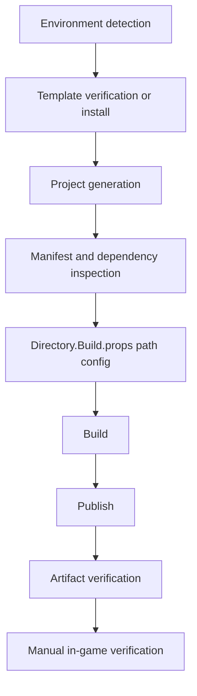

# Slay the Spire 2 Mod Workspace Setup Specification

Historical note: this document records the original `EzDailyContent` setup baseline from 2026-05-02. The active private beta deliverable is now `EZMicroBalance`; use `README.md`, `docs/PROJECT_MAP.md`, `docs/dev-environment.md`, `docs/test-plan.md`, and `docs/features/ancients-rework-v4/completion-audit.md` for current release status.

## 1. Project Overview
Build a stable, well-documented Slay the Spire 2 mod workspace for `EzDailyContent` (`AUTHOR_NAME_REPLACE_ME`) using C#/.NET, the community template, and BaseLib-aware dependency handling.

## 2. Current Goal
Complete setup infrastructure only: repository conventions, documentation, environment detection, template readiness, build/publish workflow, and artifact verification process.

## 3. Non-Goals
- No concrete cards, relics, powers, patches, localization gameplay, or gameplay behavior during setup.
- No copied game assets.
- No large copied decompiled code.
- No manifest id changes after project creation.

## 4. Assumptions
- Slay the Spire 2 is installed via Steam.
- Community STS2 template should be used when available.
- BaseLib dependency is expected for content mod workflows.
- APIs and template behavior may shift during Early Access.

## 5. Unknowns and Required Values
Known as of 2026-05-02:
- OS: Windows 11 Pro (`10.0.26200`, `64-bit`)
- Git: `2.53.0.windows.1`
- .NET SDK: `9.0.313`
- .NET host/runtime: `9.0.15`
- Working directory: `D:\Game\FOTN\dev-the-spire`
- Git toplevel: `D:\Game\FOTN`
- Game root: `D:\Steam\steamapps\common\Slay the Spire 2`
- Current branch target: public beta
- Observed in-game version: `v0.104.0`
- Observed in-game version date: `2026.04.23`
- Correct currently verified public beta version: `v0.104.0, 2026.04.23`
- Template package: `Alchyr.Sts2.Templates` `2.3.9`
- Content template short name: `alchyrsts2contentmod`
- Manifest id: `EzDailyContent`
- BaseLib expected runtime path installed: `D:\Steam\steamapps\common\Slay the Spire 2\mods\BaseLib`
- BaseLib suspicious root-level path found: `D:\Steam\steamapps\common\Slay the Spire 2\BaseLib`
- BaseLib root-level manifest version: `v0.1.3`
- Project NuGet BaseLib package: `Alchyr.Sts2.BaseLib` `3.1.0`
- Last successful build: `dotnet build` during final setup review on 2026-05-02
- Last successful publish: `dotnet publish` during final setup review on 2026-05-02
- Manual game verification: succeeded; BaseLib and EzDailyContent appeared in Mod Settings and were enabled.

Unknown / TODO:
- Manifest author is still `AUTHOR_NAME_REPLACE_ME` until the user supplies the desired author name.

## 6. Technical Architecture
- Root-level operational docs and agent policy (`AGENTS.md`, `docs/*`).
- Template-generated mod project at repository root.
- Generated Godot resources in `EzDailyContent/`.
- Generated C# scaffolding in `EzDailyContentCode/`.
- Shared build policy via local gitignored `Directory.Build.props`, committed `Directory.Build.props.example`, and template `Sts2PathDiscovery.props`.
- Build/publish executed with `dotnet` CLI.
- Human-in-loop game launch and mod-list verification.

## 7. Target Repository Structure
Actual generated structure:

```text
dev-the-spire/
  .gitattributes
  .gitignore
  AGENTS.md
  README.md
  Directory.Build.props
  Directory.Build.props.example
  EzDailyContent.csproj
  EzDailyContent.json
  EzDailyContent.sln.DotSettings
  Sts2PathDiscovery.props
  export_presets.cfg
  project.godot
  EzDailyContent/
  EzDailyContentCode/
  docs/
```

## 8. AGENTS.md Plan
`AGENTS.md` defines hard setup rules, immutable manifest-id rule, BaseLib policy, build/publish commands, documentation duties, and Early Access resilience behavior for future Codex sessions.

## 9. Setup Plan Map


## 10. Implementation Phases
1. Phase 0: Repository and environment inspection
2. Phase 1: Git checkpoint
3. Phase 2: Create/verify AGENTS.md
4. Phase 3: Create setup documents
5. Phase 4: Verify .NET SDK
6. Phase 5: Verify/install template package
7. Phase 6: Create mod project
8. Phase 7: Inspect generated project
9. Phase 8: Configure Directory.Build.props
10. Phase 9: Verify BaseLib status
11. Phase 10: Build
12. Phase 11: Publish
13. Phase 12: Artifact verification
14. Phase 13: Testing checklist finalization
15. Phase 14: Release checklist finalization
16. Phase 15: Final setup review

Current phase status:
- Phases 0 through 15 completed.
- Phase 11 publish succeeded.
- Manual in-game verification succeeded.
- Remaining non-setup cleanup: replace the manifest author placeholder after the user supplies the desired author name.

## 11. Environment Detection Plan
Use safe read-only checks for:
- `git status --short --branch`
- `dotnet --info`, `dotnet --list-sdks`
- `dotnet new list sts2`
- common Steam install path probes
- `godot` / `megadot` command and common path probes
Record unknowns as TODO, not guessed values.

## 12. Template Setup Plan
Completed:
- Installed `Alchyr.Sts2.Templates` `2.3.9`.
- Detected `alchyrsts2contentmod` as the content-mod template.
- Generated project using `--ModAuthor AUTHOR_NAME_REPLACE_ME`.

## 13. BaseLib Setup Plan
Manifest dependency:
- `dependencies`: `["BaseLib"]`

Expected runtime BaseLib:
- Path: `D:\Steam\steamapps\common\Slay the Spire 2\mods\BaseLib`
- Required files: `BaseLib.json`, `BaseLib.dll`, `BaseLib.pck`
- Current status: installed and verified.
- Current runtime version: `v3.1.0`

Suspicious root-level BaseLib:
- Path: `D:\Steam\steamapps\common\Slay the Spire 2\BaseLib`
- Version: `v0.1.3`
- Files found: `BaseLib.json`, `BaseLib.dll`, `BaseLib.pck`

Project NuGet package:
- `Alchyr.Sts2.BaseLib` resolves to `3.1.0`

Status:
- Runtime BaseLib path exists under `mods\BaseLib`.
- Runtime BaseLib version `v3.1.0` matches project package `3.1.0`.
- The old root-level BaseLib folder remains present and should be left untouched unless explicitly cleaned up later.
- Do not fabricate BaseLib files.

## 14. Directory.Build.props Plan
Completed:
- Set `Sts2Path` to `D:/Steam/steamapps/common/Slay the Spire 2`.

Completed:
- `EzDailyContent.sln` exists and contains `EzDailyContent.csproj`.

## 15. Build Plan
Completed:
- `dotnet build` succeeded.
- Result: 0 warnings, 0 errors.
- Build copied `EzDailyContent.dll` and `EzDailyContent.json` to the game mods folder.

## 16. Publish Plan
Completed:
- `dotnet publish`

Current result:
- Succeeded and verified DLL, JSON, and PCK artifacts in the game mods folder.

## 17. Game Verification Plan
Manual verification succeeded. `EzDailyContent.pck` exists.

Confirmed in Slay the Spire 2 Mod Settings:
1. BaseLib appears.
2. BaseLib is enabled.
3. EzDailyContent appears.
4. EzDailyContent is enabled.
5. Screenshot-observed in-game version is `v0.104.0`, date `2026.04.23`.
6. Current branch target is public beta.

## 18. Logging and Debugging Plan
Likely logs:
- Windows: `%APPDATA%/SlayTheSpire2/logs/godot.log`
- macOS: `~/Library/Application Support/SlayTheSpire2/logs/godot.log`
- Linux: `~/.local/share/SlayTheSpire2/logs/godot.log`

## 19. Documentation Plan
Keep docs synchronized with each setup decision:
- `SETUP_SPEC.md`: strategy, status, and criteria
- `PROJECT_MAP.md`: real structure and milestones
- `dev-environment.md`: detected values and TODOs
- `test-plan.md`: validation and triage
- `release-checklist.md`: release safety gates
- `codex-workflow.md`: repeatable Codex usage
- `first-feature-backlog.md`: future-only feature ideas

## 20. Git and Rollback Plan
- Use small, reviewable checkpoints.
- Do not revert unrelated changes.
- If a phase fails, stop and document blocker before proceeding.
- Prefer path-limited staging/commits for this workspace.

## 21. Risk Register
| Risk | Likelihood | Impact | Mitigation |
| ---- | ---------: | -----: | ---------- |
| Solution/project drift | Low | Medium | Keep `EzDailyContent.sln` updated when project files are added or renamed. |
| BaseLib runtime missing under `mods\BaseLib` | High | High | Install matching BaseLib runtime release under `D:\Steam\steamapps\common\Slay the Spire 2\mods\BaseLib`. |
| BaseLib version mismatch | High | High | Match runtime BaseLib release to project package `Alchyr.Sts2.BaseLib` `3.1.0`. |
| Template/package naming drift | Medium | Medium | Re-check template list after package updates; avoid hardcoded shortnames. |
| Early Access API changes | High | Medium | Keep setup docs and AGENTS rules updated each session. |

## 22. Future Feature Roadmap
After setup complete:
1. First tiny content pack (3 cards, 1 relic, 1 power)
2. English and Simplified Chinese localization
3. Placeholder/original art pipeline
4. Feature-by-feature build/publish checks

## 23. Commands Expected During Build Mode
Read-only:
- `Get-Location`
- `Get-ChildItem -Force`
- `git status --short --branch`
- `dotnet --info`
- `dotnet --list-sdks`
- `dotnet new list sts2`

Write/setup:
- `dotnet new install Alchyr.Sts2.Templates`
- `dotnet new alchyrsts2contentmod -n EzDailyContent --ModAuthor AUTHOR_NAME_REPLACE_ME`
- `dotnet build`
- `dotnet publish`

## 24. Completion Criteria
Complete:
- AGENTS.md and required docs exist with non-placeholder content.
- Template-generated mod project exists.
- Manifest id recorded and protected.
- BaseLib dependency status documented.
- Build status known and successful.
- Publish status known and successful without the previous missing-solution warnings.
- DLL, JSON, and PCK artifacts verified.
- Manual game verification succeeded.

Pending:
- Desired manifest author name must be supplied before replacing `AUTHOR_NAME_REPLACE_ME`.

## 25. What I Need From The User
Provide the desired manifest author name to replace `AUTHOR_NAME_REPLACE_ME`.
